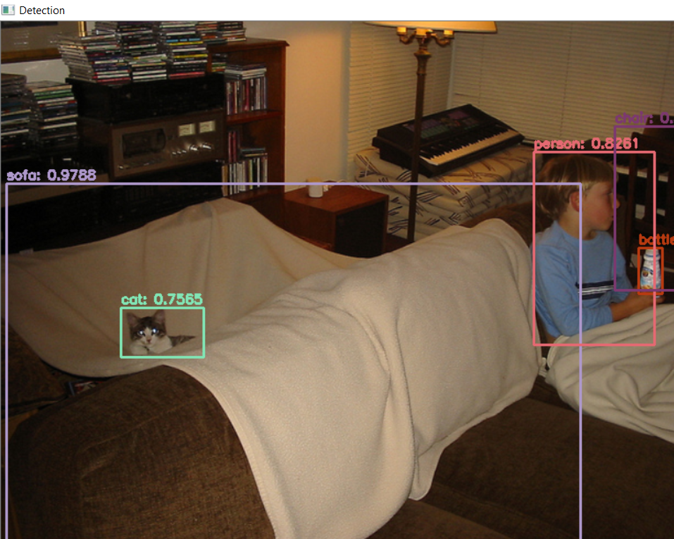

# YoloV3_Object_Detection_OpenCV
Detecting objects in images and videos using YOLOv3

## Overview
This python module provides the necessary code to perform object detection on images, videos and as well as on live webcam feed.

YOLO (You Only Look Once) is an object detection architecture that is quite popular for it's speed. This repo contains code to implement it using opencv.

Since we'll be using a pre-trained model, we'd have to download certain files. The "weights" file , the "configuration" file, and the "coco-names" file. The weights and the configuration file can be found in this [link](https://pjreddie.com/darknet/yolo/) and the coco-names file can be downloaded/copied from [here](https://github.com/pjreddie/darknet/blob/master/data/coco.names). There are several pre-trained models available and we would be using the "YOLOv3–416" model. The models are trained on the MS COCO dataset which has 80 classes of objects present in it.

You can read more about the structure and function of the code here:- 

## Arguments

```
    --video           ---->     Path to video file
    --image           ---->     Path to the test images
    --camera          ---->     To use the live feed from web-cam
    --weights         ---->     Path to model weights
    --configs         ---->     Path to model configs
    --class_names     ---->     Path to class-names text file
    --conf_thresh     ---->     Confidence threshold value
    --nms_thresh      ---->     Confidence threshold value
    
```
## Usage
* For testing on images  
`python Obj_main.py --image <path to the image file> --weights <path to the weights file> --configs <path to the config file> --class_names <path to the class ids file>`

* For testing on videos  
`python Obj_main.py --video <path to the video file> --weights <path to the weights file> --configs <path to the config file> --class_names <path to the class ids file>`

* For testing on web-cam feed  
`python Obj_main.py --camera True --weights <path to the weights file> --configs <path to the config file> --class_names <path to the class ids file>`

The values for the confidence threshold and NMS threshold are set at 0.5 and 0.4 respectively. They can also be altered using  
--conf_thresh and --nms_thresh

## Output



## Notes
The code is written in such a way that it searches for the configuration, weights, and class-names file in the current working directory, if nothing is passed in as arguments. So please make sure you provide the path explicitly if you're files are in another directory using the arguments given above.


Happy Learning People ! Keep chasing your dreams ! ⭐️
